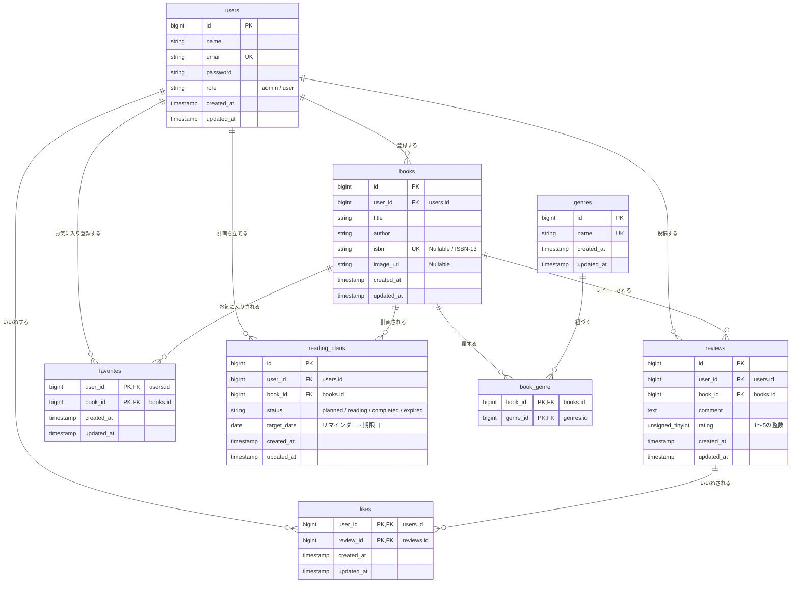

# BookShelf 書籍レビューアプリ

## 1. プロジェクトの目的と概要説明
本プロジェクトは、書籍の登録・管理、およびユーザー間でのレビュー共有を可能にするWEBアプリケーション「BookShelf」です。
ユーザーは読んだ書籍を登録して評価・レビューを投稿できるほか、他ユーザーのレビューに対する「いいね」機能、書籍の「お気に入り」機能、平均評価に基づく「ランキング機能」を利用できます。

本システムは以下の2つのフェーズに分けて開発が進行します。
* **[フェーズ1] 基本機能の実装**: 認証、書籍CRUD、レビュー、お気に入り、いいね、ジャンル管理、ランキング機能、および外部向け公開API（認証なし）の実装。
* **[フェーズ2] 応用機能の実装**: 高度な検索・フィルタ、ISBN-13コードによるGoogle Books API連携（書籍情報自動取得）、マイ読書レポート（統計ダッシュボード）、公開APIへのSanctumによるトークン認証追加、および読書計画機能とリマインダー・自動失効バッチの導入。

---

## 2. アーキテクチャ方針
本システムは、同一アプリケーション内でマルチエンドポイント構成を採用しています。
* **Webブラウザ向け（Traditional Web）**: Bladeテンプレートを使用し、セッション認証（Laravel FortifyによるCookie認証）で動作します。
* **外部アプリケーション向け（公開API）**: 応答形式はすべてJSONとし、フェーズ2にて Laravel Sanctum によるトークン認証を後付けします。

---

## 3. 技術スタック一覧
* **OS**: Dockerが動作する任意のOS
* **PHP**: 8.5
* **Laravel**: 10.x (認証基盤: Laravel Fortify / API認証: Laravel Sanctum)
* **DB**: MySQL 8.4 (開発環境はLaravel Sail / phpMyAdmin)
* **フロントエンド**: Vite, Tailwind CSS ^3.4.0, @tailwindcss/forms
* **コード品質管理**: Laravel Pint (PSR-12準拠), Larastan (PHPStan)

---

## 4. データベース設計 (ER図)



---

## 5. 画面設計・ルーティング一覧

### Webブラウザ向け画面（セッション認証必須項目あり）

| 画面・機能 | メソッド | パス | 認証・認可 | 備考 |
| :--- | :--- | :--- | :--- | :--- |
| ログイン | GET | `/login` | 不要 | ログインフォーム表示 |
| 会員登録 | GET | `/register` | 不要 | 会員登録フォーム表示 |
| 書籍一覧（トップ） | GET | `/` または `/books` | 不要 | 10件/P（最新順）※応用で検索・ソート追加 |
| 書籍詳細 | GET | `/books/{book}` | 不要 | 書籍情報、レビュー、いいね等の表示 |
| 書籍登録 | GET | `/books/create` | **認証必須** | 全ジャンルをチェックボックス表示 ※応用でISBN検索追加 |
| 書籍編集 | GET | `/books/{book}/edit` | **認証＋認可必須** | 作成者（所有者）本人のみ閲覧可 |
| ジャンル一覧 | GET | `/genres` | **認証必須** | 各ジャンルの書籍数カウントを表示 |
| ジャンル詳細 | GET | `/genres/{genre}` | **認証必須** | ジャンルに紐づく書籍を10件/Pで表示 |
| ジャンル登録 | GET | `/genres/create` | **認証必須** | 新規ジャンル登録画面 |
| ジャンル編集 | GET | `/genres/{genre}/edit` | **認証必須** | ジャンル編集画面 |
| レビュー編集 | GET | `/reviews/{review}/edit` | **認証＋認可必須** | 投稿者本人のみ閲覧可 |
| お気に入り一覧 | GET | `/favorites` | **認証必須** | ユーザーのお気に入り書籍を10件/Pで表示 |
| ランキング | GET | `/ranking` | 不要 | レビュー平均評価TOP10を表示 |
| **[応用]** マイ読書レポート | GET | `/reports` | **認証必須** | ログインユーザーの読書統計ダッシュボード |
| **[応用]** 読書計画一覧 | GET | `/reading-plans` | **認証必須** | 自身の計画一覧。状態絞り込みと操作ボタン配置 |
| **[応用]** 読書計画作成 | GET | `/reading-plans/create` | **認証必須** | 書籍プルダウンと期日入力フォーム |
| **[応用]** 読書計画編集 | GET | `/reading-plans/{plan}/edit`| **認証＋認可必須** | 所有者のみ閲覧可。期日変更フォーム |
| **[応用]** 通知一覧 | GET | `/notifications` | **認証必須** | リマインダー等の通知一覧。既読化操作付き |

---

## 6. 公開APIエンドポイント一覧（JSONレスポンス）
すべてのAPIコントローラーは `Api\V1` 名前空間（`app/Http/Controllers/Api/V1/`）に配置します。

| メソッド | パス | 説明 | 認証・認可 |
| :--- | :--- | :--- | :--- |
| **GET** | `/api/v1/books` | 書籍一覧をJSON形式で取得する | 不要 |
| **GET** | `/api/v1/books/{book}` | 特定の書籍詳細をJSON形式で取得する | 不要 |
| **POST** | `/api/v1/books` | 新しい書籍を新規登録する | ★ **Sanctumトークン認証必須** |
| **PUT** | `/api/v1/books/{book}` | 書籍情報を更新する | ★ **Sanctum認証** ＋ **BookPolicy** (所有者限定) |
| **DELETE**| `/api/v1/books/{book}` | 書籍を削除する | ★ **Sanctum認証** ＋ **BookPolicy** (所有者限定) |

---

## 7. 初期設定手順（開発環境構築）

### ⚙️ 前提条件
ローカル環境に **Docker** および **Docker Desktop** がインストールされ、起動していること。

### 🚀 構築手順
1. **リポジトリのクローンと移動**
   ```bash
   git clone <リポジトリURL>
   cd <プロジェクトディレクトリ名>
   ```
2. **環境設定ファイルの作成**
   ```bash
   cp .env.example .env
   ```
   必要に応じて `.env` 内のデータベース設定（Laravel Sail標準設定）等を確認してください。

3. **依存パッケージのインストール（Docker経由）**
   ```bash
   docker run --rm \
       -u "$(id -u):$(id -g)" \
       -v "$(pwd):/var/www/html" \
       -w /var/www/html \
       laravelsail/php85-composer:latest \
       composer install --ignore-platform-reqs
   ```

4. **Laravel Sailの起動**
   ```bash
   ./vendor/bin/sail up -d
   ```

5. **アプリケーションキーの生成とマイグレーション・シーダー実行**
   ```bash
   ./vendor/bin/sail artisan key:generate
   ./vendor/bin/sail artisan migrate --seed
   ```

6. **フロントエンド資産のビルド**
   ```bash
   ./vendor/bin/sail npm install
   ./vendor/bin/sail npm run dev
   ```

### 🔗 開発環境URL
* **アプリケーションTOP**: [http://localhost](http://localhost)
* **phpMyAdmin (DB管理)**: [http://localhost:8080](http://localhost:8080) （※Sailのポート設定による）

---

## 8. コード品質の維持とテストの実行
本プロジェクトでは以下のコード品質を厳格に維持します。

* **コード自動整形 (Laravel Pint)**
  コミット前に必ず以下のコマンドを実行し、PSR-12に準拠した整形を行ってください。
  ```bash
  ./vendor/bin/sail bin pint
  ```
  ※ 提出時の採点基準として、`./vendor/bin/sail bin pint --test` でエラーが出ないことが必須です。

* **テストコードの実行とカバレッジ目標**
  ```bash
  ./vendor/bin/sail artisan test --coverage
  ```
  * **フェーズ1完了時**: テストカバレッジ **60%超** を達成すること。
  * **フェーズ2完了時**: テストカバレッジ **80%以上** を達成すること（外部APIテストは `Http::fake()` でモック化すること）。

---

## 作業者
* **あなたの名前** (ここに名前を記述してください)
